# Kronos STV User Manual
<!-- TOC -->
* [Kronos STV User Manual](#kronos-stv-user-manual)
* [First launch](#first-launch)
  * [Setting the work directory](#setting-the-work-directory)
* [Main screen](#main-screen)
* [The main entities in Kronos](#the-main-entities-in-kronos)
  * [Institution](#institution)
  * [Election](#election)
  * [Scenario](#scenario)
* [Example 1 : Creating a general election and examining a scenario built upon it](#example-1--creating-a-general-election-and-examining-a-scenario-built-upon-it)
  * [Creating a general election](#creating-a-general-election)
  * [Creating a scenario](#creating-a-scenario)
    * [Scenario table](#scenario-table)
    * [Scenario screen buttons](#scenario-screen-buttons)
      * [Add button](#add-button)
      * [Remove button](#remove-button)
      * [Notes button](#notes-button)
      * [Save button](#save-button)
      * [Export button](#export-button)
      * [Copy button](#copy-button)
      * [Groups button](#groups-button)
      * [Evaluate button](#evaluate-button)
    * [Seats](#seats)
  * [Evaluating the scenario](#evaluating-the-scenario)
<!-- TOC -->
# First launch
Upon first launch, Kronos will detect that it is running for the first time on your system.
It will require you to set a work directory, where all your scenarios, templates and other Kronos related user data will be stored.
## Setting the work directory
To set the work directory, follow the steps below : 
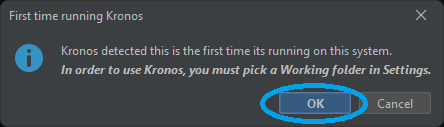 
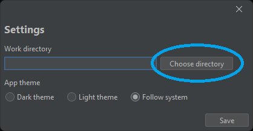
  In the Directory picker, choose any directory you like; This is where your user data will be stored.
  For this example, a newly created directory in "Documents" will be used : 
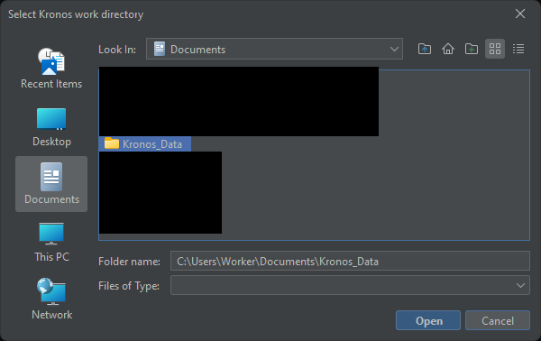
 After you select the directory, click "Save" on the Settings window, and you will be ready to use Kronos STV.
# Main screen
The main screen will be shown after setting the work directory : 
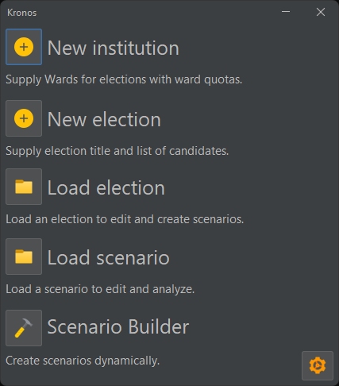
 Each option corresponds to a function that will be explained in detail via certain examples below.
# The main entities in Kronos
In order to understand how Kronos works, its crucial to understand the underlying entities the functionality is based upon.
## Institution
An institution is a set of wards, that make up an institution (it could be a school, university etc.) .
## Election
An election is a set of candidates that compete. An election can be based upon an Institution or it may be independant and only contain candidates (General election).
## Scenario
A scenario is based upon an election, and contains all the ballot combination (the order of choice from voters) and each combination count. A scenario can then be examined to get the results (how many votes each candidate got etc.)
# Example 1 : Creating a general election and examining a scenario built upon it
## Creating a general election
A general election, is an election that is not based upon an institution. It only contains the candidates.
  To create a general election, start by selecting the "New election" option in the main screen :
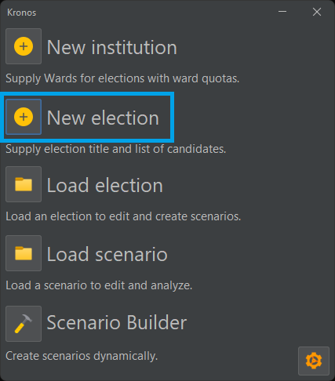
 Select "General election" : 
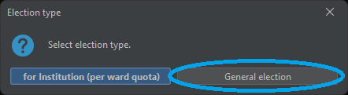
 You can then enter the candidates using the <b>"Add +"</b> Button, and typing their name on the candidates table : 
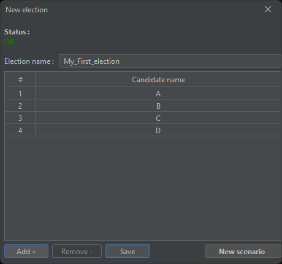
 You can then save the election for later use using the <b>"Save"</b> button.
 When your election is complete, you can create a new scenario based upon it with the <b>"New scenario"</b> button.
## Creating a scenario
In the scenario creation screen, there are many things to break down :
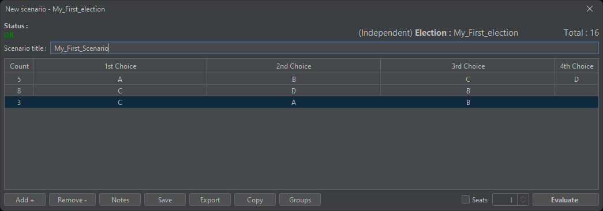
### Scenario table
The scenario table consists of columns and rows. Each column represents a choice (besides the "Count" column) and each row represents a combination.
You can create a combination by clicking on the blank places of every row, a combo box menu will pop up showing all available candidates : 
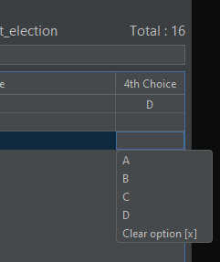
### Scenario screen buttons
#### Add button
The add button, adds a row to the scenario table.
#### Remove button
Removes a row from the scenario table.
#### Notes button
This button opens a new screen, for taking notes for your scenario. The notes can be any information you need specific to your scenario.
#### Save button
Saves the scenario to your work directory.
#### Export button
Exports the scenario, <b>the election it is based upon and the institute it is based upon (if any)</b> to a ZIP file.
#### Copy button
Copies the scenario table in CSV form to your clipboard.
#### Groups button
Opens a new screen where you can define groups of candidates (later used in scenario builder functionality).
#### Evaluate button
Evaluates the scenario and displays the results.
### Seats
Seats are the number of maximum candidates that can be elected. For example, if the seats checkbox is checked and the value is set to 3, only 3 candidates can be elected.
If left unchecked, every candidate will be elected. 
## Evaluating the scenario
To evaluate the scenario, select the <b>"Evaluate"</b> button : 
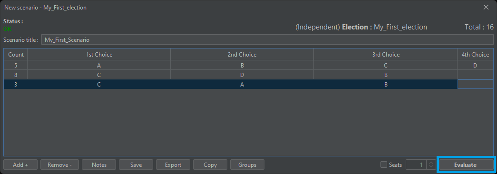
Then, the results window will open :  
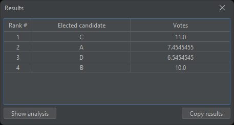 
The "Show analysis" button, expands the results and shows all the steps taken to generate those results :
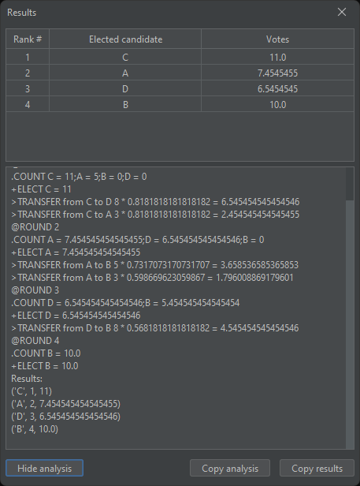 
The "Copy analysis" and "Copy results" copy the analysis text and the results table to your clipboard respectively.