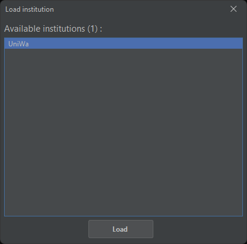
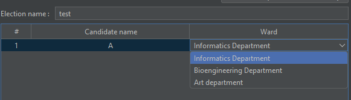

# Kronos STV User Manual
<!-- TOC -->
* [Kronos STV User Manual](#kronos-stv-user-manual)
* [First launch](#first-launch)
  * [Setting the work directory](#setting-the-work-directory)
* [Main screen](#main-screen)
* [The main entities in Kronos](#the-main-entities-in-kronos)
  * [Institution](#institution)
  * [Election](#election)
  * [Scenario](#scenario)
* [Example 1 : Creating a general election and examining a scenario built upon it](#example-1--creating-a-general-election-and-examining-a-scenario-built-upon-it)
  * [Creating a general election](#creating-a-general-election)
  * [Creating a scenario](#creating-a-scenario)
    * [Scenario table](#scenario-table)
      * [Selecting candidates for each combination](#selecting-candidates-for-each-combination)
      * [Changing the count for each combination](#changing-the-count-for-each-combination)
    * [Scenario screen buttons](#scenario-screen-buttons)
      * [Add button](#add-button)
      * [Remove button](#remove-button)
      * [Notes button](#notes-button)
      * [Save button](#save-button)
      * [Export button](#export-button)
      * [Copy button](#copy-button)
      * [Groups button](#groups-button)
      * [Evaluate button](#evaluate-button)
    * [Seats](#seats)
  * [Evaluating the scenario](#evaluating-the-scenario)
* [Example 2 : Creating an institutional election](#example-2--creating-an-institutional-election)
  * [Creating an institution](#creating-an-institution)
    * [Ward table](#ward-table)
    * [Ward quota](#ward-quota)
  * [Creating an institutional election](#creating-an-institutional-election)
    * [Option 1](#option-1)
    * [Option 2](#option-2)
<!-- TOC -->
# First launch
Upon first launch, Kronos will detect that it is running for the first time on your system.
It will require you to set a work directory, where all your scenarios, templates and other Kronos related user data will be stored.
## Setting the work directory
To set the work directory, follow the steps below : 
 

  In the Directory picker, choose any directory you like; This is where your user data will be stored.
  For this example, a newly created directory in "Documents" will be used : 

 After you select the directory, click "Save" on the Settings window, and you will be ready to use Kronos STV.
# Main screen
The main screen will be shown after setting the work directory : 

 Each option corresponds to a function that will be explained in detail via certain examples below.
# The main entities in Kronos
In order to understand how Kronos works, its crucial to understand the underlying entities the functionality is based upon.
## Institution
An institution is a set of wards, that make up an institution (it could be a school, university etc.) .
## Election
An election is a set of candidates that compete. An election can be based upon an Institution or it may be independant and only contain candidates (General election).
## Scenario
A scenario is based upon an election, and contains all the ballot combination (the order of choice from voters) and each combination count. A scenario can then be examined to get the results (how many votes each candidate got etc.)
# Example 1 : Creating a general election and examining a scenario built upon it
## Creating a general election
A general election, is an election that is not based upon an institution. It only contains the candidates.
  To create a general election, start by selecting the "New election" option in the main screen : 

 Select "General election" : 

 You can then enter the candidates using the <b>"Add +"</b> Button, and typing their name on the candidates table : 

 You can then save the election for later use using the <b>"Save"</b> button.
 When your election is complete, you can create a new scenario based upon it with the <b>"New scenario"</b> button.
## Creating a scenario
In the scenario creation screen, there are many things to break down :

### Scenario table
#### Selecting candidates for each combination
The scenario table consists of columns and rows. Each column represents a choice (besides the "Count" column) and each row represents a combination.
You can create a combination by clicking on the blank places of every row, a combo box menu will pop up showing all available candidates : 

#### Changing the count for each combination
The first column is the "Count" row that specifies how many voters had that exact combination on their ballot paper. 

### Scenario screen buttons
#### Add button
The add button, adds a row to the scenario table.
#### Remove button
Removes a row from the scenario table.
#### Notes button
This button opens a new screen, for taking notes for your scenario. The notes can be any information you need specific to your scenario.
#### Save button
Saves the scenario to your work directory.
#### Export button
Exports the scenario, <b>the election it is based upon and the institute it is based upon (if any)</b> to a ZIP file.
#### Copy button
Copies the scenario table in CSV form to your clipboard.
#### Groups button
Opens a new screen where you can define groups of candidates (later used in scenario builder functionality).
#### Evaluate button
Evaluates the scenario and displays the results.
### Seats
Seats are the number of maximum candidates that can be elected. For example, if the seats checkbox is checked and the value is set to 3, only 3 candidates can be elected.
If left unchecked, every candidate will be elected. 
## Evaluating the scenario
To evaluate the scenario, select the <b>"Evaluate"</b> button : 

Then, the results window will open :  
 
The "Show analysis" button, expands the results and shows all the steps taken to generate those results :
 
The "Copy analysis" and "Copy results" copy the analysis text and the results table to your clipboard respectively.
# Example 2 : Creating an institutional election
## Creating an institution
An institution is a set of wards, start creating one by selecting "New institution" in the main screen : 
 
 
The above screen functions similarly to the other screens presented previously.
### Ward table
The ward table contains 3 rows:
- Number row
- Ward name (name of the ward)
- Ward size (count of the ward's faculty)
### Ward quota
The ward quota, is explained directly on the UI and its the maximum number of candidates allowed to be elected per ward.
For example if the ward quota is 2, each ward is allowed to have at MOST 2 candidates elected. Any candidate above that limit will not be elected, even if they gather more votes than the election quota (not to be confused with ward quota)
## Creating an institutional election
To create an institutional election you either click on "New election" on the institution screen OR you choose the "institutional" option when creating a new election.
The latter option will open the load institution screen, where you can select any saved institutions.
### Option 1

### Option 2
 
 
 
After loading the institution, you will be greeted with the election creation screen, but with some changes :
 
Now the screen (compared to the original [new election screen](#creating-a-general-election)) has 3 rows instead of 2, the 3rd row is the Ward each candidate belongs to.
Also, you can edit wards (remove,add,rename) with the "Edit wards" button. 
The Ward selection for each candidate, works in a similar fashion with the [option selector in the scenario table](#scenario-table)
 
 
After making the institutional election, the next steps are exactly the same as a non-institutional election (to examine scenarios).
# Scenario builder
The scenario builder function, is used to build scenarios and find the conditions where a group of candidates will be victorious. In other words, it will assist in finding the minimum amount of votes specific combinations need in a scenario, for a group of candidates to win.
